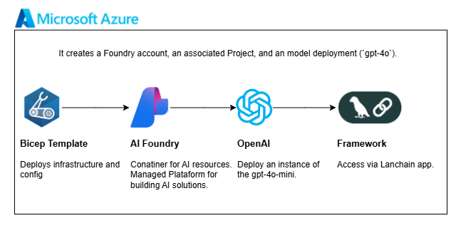

# Azure AI Foundry

This module is a compact infrastructure-first demo for Azure AI Foundry. It is a good starting point when you want a small, readable deployment for a Foundry account, an AI project, and a simple model setup.



## What This Module Covers

- Azure AI Foundry account provisioning
- AI project creation
- Optional model deployment for experimentation
- PowerShell-driven deployment with Bicep as the infrastructure definition

## Structure

```text
Azr.AIFoundry/
|-- README.MD
`-- infra/
    |-- README.md
    |-- deploy_template.ps1
    |-- main.bicep
    |-- main.dev.bicepparam
    `-- modules/
        `-- aifoundry.bicep
```

## Quick Start

1. Review [infra/README.md](infra/README.md).
2. Set the environment values expected by [infra/deploy_template.ps1](infra/deploy_template.ps1), especially `SUBSCRIPTION_ID`.
3. Run the deployment from the `infra` folder:

```powershell
.\deploy_template.ps1
```

## Reader Guide

- Start here for the scenario summary.
- Use [infra/README.md](infra/README.md) for parameters, prerequisites, and deployment details.
- Reuse the LangChain example from the infra README if you want a quick post-deployment test.
