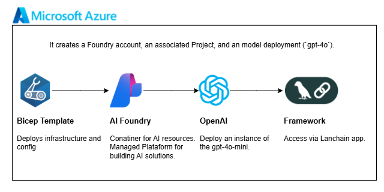

# Azure AI Foundry – Minimal Deployment

This setup deploys a basic **Azure AI Foundry** environment using Bicep.  
It creates a Foundry account, an associated Project, and an optional model deployment (`gpt-4o`).



## Infrastructure Overview

- **AI Foundry** (`Microsoft.CognitiveServices/accounts`)
- **AI Project** (`Microsoft.CognitiveServices/accounts/projects`)
- **Model Deployment** (`Microsoft.CognitiveServices/accounts/deployments`)

## Parameters

| Name | Default | Description |
|------|----------|-------------|
| `aiFoundryName` | `'uniquename'` | Name of the Foundry instance |
| `aiProjectName` | `'${aiFoundryName}-proj'` | Name of the AI project |
| `location` | `'eastus2'` | Azure region |

## Prerequisites

- [Azure CLI](https://learn.microsoft.com/cli/azure/install-azure-cli)
- [Bicep CLI](https://learn.microsoft.com/azure/azure-resource-manager/bicep/install)

Check version:
```
bicep --version
```

## Test model using Langchain 

```
from langchain_azure_ai.chat_models import AzureAIChatCompletionsModel

def foundry_model(question: str):
    llm = AzureAIChatCompletionsModel(
        endpoint=os.getenv("AZURE_INFERENCE_ENDPOINT"),
        credential=os.getenv("AZURE_INFERENCE_CREDENTIAL"), 
        model="gpt-4o-mini"
    )
    messages = [
        SystemMessage(content="Calculate the optimal strategy to reduce carbon emissions in urban areas."),
        HumanMessage(content=question)
    ]
    response = llm.invoke(messages)
    print(response)
```