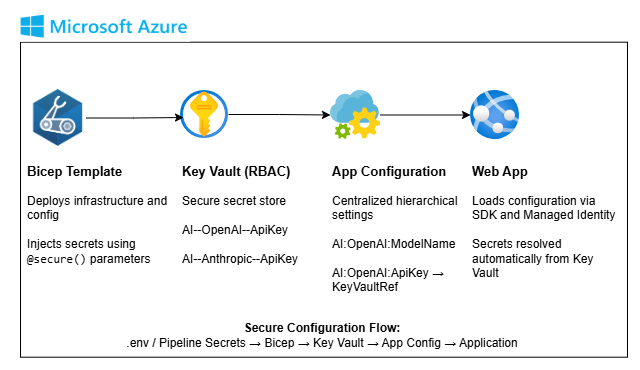

# Azure App Configuration and Key Vault

This module focuses on secure configuration management in Azure. It shows how to combine Azure App Configuration for non-secret settings with Azure Key Vault for secrets while keeping the configuration structure readable and close to how real applications consume settings.



## What This Module Covers

- Azure App Configuration
- Azure Key Vault
- Key Vault references from App Configuration
- Hierarchical configuration naming
- Bicep-based infrastructure deployment

## Structure

```text
Azr.AppConfig.KV/
|-- README.MD
`-- infra/
    |-- README.md
    |-- main.bicep
    |-- main.dev.bicepparam
    `-- modules/
        |-- appconfig.bicep
        `-- keyvault.bicep
```

## Quick Start

1. Open [infra/README.md](infra/README.md) for the deployment steps.
2. Prepare the secret values expected by the template.
3. Deploy from the `infra` folder using the Azure CLI and Bicep commands documented there.

## Reader Guide

This module is especially useful if you want a reference for separating:

- deployable infrastructure
- secure values
- configuration keys that map cleanly into application objects
