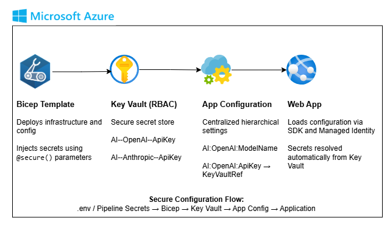

# Azure App Configuration + Key Vault – Secure Configuration Demo

This repository demonstrates **secure, hierarchical configuration management** in Azure using **Azure App Configuration** and **Azure Key Vault**, following Microsoft's recommended practices for cloud-native applications.



## Infrastructure Overview

Provisions the following Azure resources using **Bicep** templates:

- **Azure App Configuration** – Centralized storage for non-sensitive hierarchical settings (e.g., `AI:OpenAI:ModelName`)
- **Azure Key Vault** – Secure secret management with encryption-at-rest
- **RBAC-based authorization** – Uses Azure AD roles instead of legacy access policies
- **Key Vault References** – App Configuration values that securely point to Key Vault secrets

## Hierarchical Configuration Structure

Configuration keys follow a structured naming convention:

```
AI:OpenAI:ModelName
AI:OpenAI:Temperature  
AI:OpenAI:MaxTokens
AI:OpenAI:ApiKey (Key Vault reference)
AI:Anthropic:ModelName
AI:Anthropic:Temperature
AI:Anthropic:MaxTokens  
AI:Anthropic:ApiKey (Key Vault reference)
```

These map directly to strongly-typed configuration objects in your application code.

## Prerequisites

- [Azure CLI](https://learn.microsoft.com/cli/azure/install-azure-cli)
- [VS Code Bicep Extension](https://marketplace.visualstudio.com/items?itemName=ms-azuretools.vscode-bicep)
- **Bicep CLI**: Download [bicep-setup-win-x64.exe](https://github.com/Azure/bicep/releases/latest/download/bicep-setup-win-x64.exe)

Verify installation: `bicep --version`

## Deployment

### Local Development

1. Create a `.env` file in the project root (ignored by Git):
   ```
   OPENAI_API_KEY=sk-your-openai-key
   ANTHROPIC_API_KEY=sk-your-anthropic-key
   ```

2. Deploy from the `/infra` directory:
   ```bash
   # Validate without deploying
   az deployment group validate \
     --resource-group my-rg \
     --template-file .\main.bicep \
     --parameters .\main.dev.bicepparam
   
   # Deploy infrastructure
   az deployment group create \
     --resource-group my-rg \
     --template-file .\main.bicep \
     --parameters .\main.dev.bicepparam
   ```

### Production/CI-CD

Store secrets in your pipeline's secure storage:

**Azure DevOps:**
```yaml
- task: AzureCLI@2
  inputs:
    inlineScript: |
      az deployment group create \
        --resource-group $(RESOURCE_GROUP) \
        --template-file main.bicep \
        --parameters main.dev.bicepparam \
        --parameters openAIKey="$(OPENAI_API_KEY)" anthropicKey="$(ANTHROPIC_API_KEY)"
```

**GitHub Actions:**
```yaml
- name: Deploy Infrastructure
  run: |
    az deployment group create \
      --resource-group ${{ secrets.AZURE_RESOURCE_GROUP }} \
      --template-file main.bicep \
      --parameters main.dev.bicepparam \
      --parameters openAIKey="${{ secrets.OPENAI_API_KEY }}" anthropicKey="${{ secrets.ANTHROPIC_API_KEY }}"
```

## Security Best Practices

- Never hardcode secrets in `.bicepparam` files or templates
- Use `@secure()` parameters in Bicep for sensitive inputs  
- Store secrets in platform-specific secure storage (not `.env` in production)
- Verify deployment: `az keyvault secret list --vault-name <vault-name> -o table`