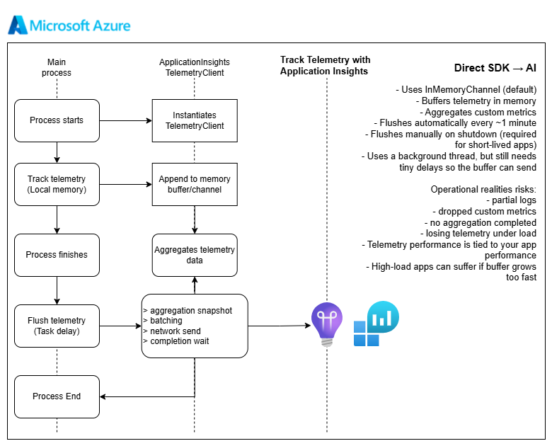
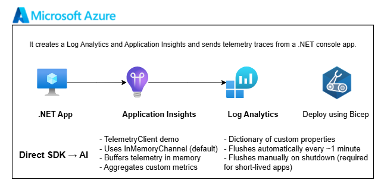

# Summary

This console app demonstrates how to send custom telemetry to Azure Application Insights using an in-process TelemetryClient.
It loads the Application Insights connection string from User Secrets, creates a new TelemetryConfiguration, and applies a custom Telemetry Initializer (ProcessRunTelemetryInitializer) that automatically attaches two custom properties to every log entry:

- RunId: a unique identifier for this execution
- ApplicationName: a custom label used to categorize logs

The app then sends a batch of demo trace messages and a test exception to Application Insights.
Finally, it calls Flush() and waits briefly to ensure all telemetry is transmitted before the process exits.

These logs appear in the AI workspace tables and can be queried using Kusto, for example:

```
traces
| where customDimensions.RunId == "{runId}"
| order by timestamp asc
```

This structure allows you to group logs by execution, enrich events with contextual metadata, and explore custom dimensions in Application Insights.



## Infra

- [Deployment files](infra)

