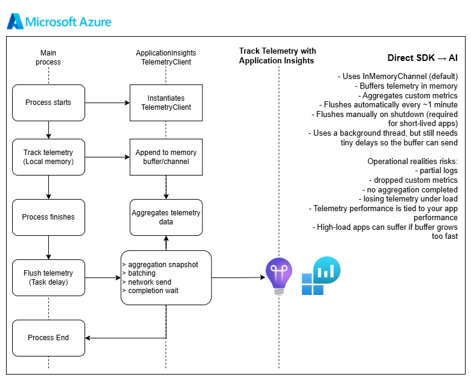

# Azure Application Insights

This module demonstrates both sides of Application Insights:

- provisioning the monitoring resources in Azure
- sending custom telemetry from a .NET console application

It is a compact reference for understanding how instrumentation, custom dimensions, and Azure-side monitoring resources fit together.



## Application Sample

The console app uses `TelemetryClient` directly and adds a custom telemetry initializer so every event includes shared context:

- `RunId` to correlate all telemetry from one execution
- `ApplicationName` to label events consistently

It emits traces and a sample exception before flushing telemetry on exit.

Example Kusto query:

```kusto
traces
| where customDimensions.RunId == "{runId}"
| order by timestamp asc
```

## Structure

```text
Azr.AppInsights/
|-- README.MD
|-- Program.cs
|-- ProcessRunTelemetryInitializer.cs
|-- Azr.AppInsights.csproj
`-- infra/
    |-- README.md
    |-- deploy.ps1
    |-- main.bicep
    |-- main.dev.bicepparam
    `-- modules/
        |-- appinsights.bicep
        `-- law.bicep
```

## Infrastructure

The infrastructure side provisions:

- a Log Analytics workspace
- an Application Insights resource

Open [infra/README.md](infra/README.md) for deployment details.


## Quick Start

1. Deploy the monitoring resources using the instructions in [infra/README.md](infra/README.md).
2. Configure the Application Insights connection string for the console app.
3. Run the sample and inspect the telemetry in Azure Monitor.
