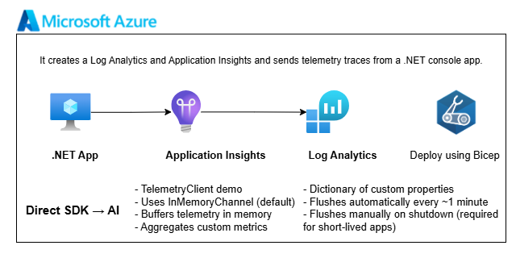

# Application Insights Infrastructure



This folder contains the infrastructure files for the Application Insights demo.

## Resources Deployed

- Log Analytics workspace
- Application Insights resource

## Log Analytics Workspace

Use the workspace as the central log store for related components.

## Application Insights

Common practice:

- One Application Insights resource per microservice
- One Application Insights resource per distinct component
- One Application Insights resource per environment

Example structure:

Component           | App Insights        | LAW
|-------------------|---------------------|---------------|
Web API             | ai-api-dev          | law-dev
Background worker   | ai-worker-dev       | law-dev
Frontend SPA        | ai-frontend-dev     | law-dev
Container App       | ai-container-dev    | law-dev

## Files

```text
infra/
|-- README.md
|-- deploy.ps1
|-- main.bicep
|-- main.dev.bicepparam
`-- modules/
    |-- appinsights.bicep
    `-- law.bicep
```

## Quick Start

From this folder:

```powershell
.\deploy.ps1
```

The script reads values from `.env`, creates the resource group, and deploys the Bicep template.

- [Application Insights FAQ](https://docs.azure.cn/en-us/azure-monitor/app/application-insights-faq)
