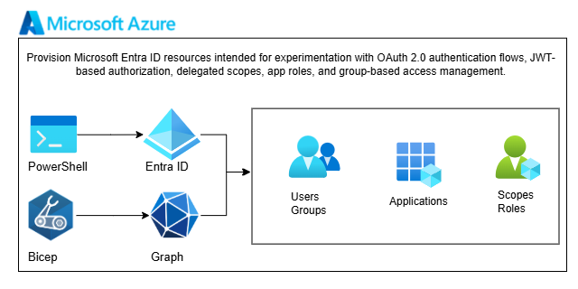

# Entra ID OAuth2 playground

Provision Microsoft Entra ID (Azure AD) resources intended for controlled experimentation with OAuth 2.0 authentication flows, JWT-based authorization, delegated scopes, app roles, and group-based access management.



## What Gets Deployed - Entra ID Objects

- **API Application** (`api-app-*`)
  - OAuth2 scopes:
    - `test.read`
    - `test.write`
  - App roles:
    - `Test.Reader`
    - `Test.Writer`
- **Client Application** (`client-app-*`)
  - Public client
  - Requests delegated access to API scopes
- **Service Principals**
  - Automatically created for both applications
- **Security Groups**
  - `grp-test-reader-*`
  - `grp-test-writer-*`
- **Role Assignments**
  - Groups mapped to corresponding API app roles

## Quick Start

1. Configure [`.env`](.env):
   ```
   SUBSCRIPTION_ID=your-subscription-id
   TENANT_ID=your-tenant-id
   DOMAIN_NAME=your-domain-name
   ```

2. Deploy:
   ```powershell
   .\deploy.ps1
   ```

3. View created resources:
   ```powershell
   .\scripts\list_security.ps1
   ```

4. Clean resources:
   ```powershell
   .\cleanup.ps1
   ```

## Structure

```
infra/
├── deploy.ps1              # Main deployment script
├── cleanup.ps1             # Remove all deployed resources
├── main.bicep              # Orchestrates API, client, groups & roles
├── modules/
│   ├── api-app.bicep       # API app registration with scopes/roles
│   ├── client-app.bicep    # Client app with API permissions
│   ├── group.bicep         # Security group creation
│   └── group-role-assignment.bicep  # Assign roles to groups
└── scripts/
    ├── create_sp.ps1       # Create service principal with RBAC
    ├── create_user.ps1     # Create test users in Entra ID
    └── list_security.ps1   # List all apps, SPs, users, groups
```

## Use Cases

- Test OAuth2 delegated permissions and app roles
- Experiment with JWT tokens and claims
- Understand group-based access control in Entra ID
- Practice app registration configuration

## Reference

[Microsoft.Graph Bicep Reference](https://learn.microsoft.com/en-us/graph/templates/bicep/reference/applications?view=graph-bicep-1.0)