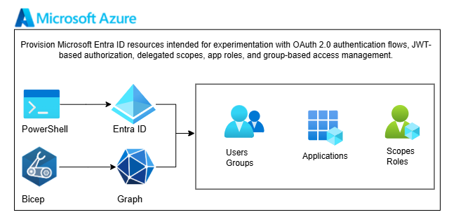

# Entra ID OAuth2 Playground

Provision Microsoft Entra ID resources intended for controlled experimentation with OAuth 2.0 authentication flows, JWT-based authorization, delegated scopes, app roles, and group-based access management.



## Entra ID Objects Created

- **API application** (`api-app-*`)
  - OAuth2 scopes: `test.read`, `test.write`
  - App roles: `Test.Reader`, `Test.Writer`
- **Client application** (`client-app-*`)
  - Public client
  - Requests delegated access to API scopes
- **Service principals**
  - Automatically created for both applications
- **Security groups**
  - `grp-test-reader-*`
  - `grp-test-writer-*`
- **Role assignments**
  - Groups mapped to the corresponding API app roles

## Quick Start

1. Configure [`.env`](.env) with the values used by `Deploy.ps1`, including:

   - `CUSTOMER_ID`
   - `ENVIRONMENT`
   - `LOCATION`
   - `TENANT_ID`
   - `SUBSCRIPTION_ID`
   - `DOMAIN_NAME`
   - `INITIAL_NEW_USER_PASSWORD`

2. Deploy:

```powershell
.\Deploy.ps1
```

3. View created resources:

```powershell
.\scripts\List_Objects.ps1
```

4. Clean resources:

```powershell
.\Cleanup-Resources.ps1
```

## Files

```text
infra/
|-- README.md
|-- .env
|-- main.bicep
|-- main.dev.bicepparam
|-- Deploy.ps1
|-- Verify.ps1
|-- Cleanup-Resources.ps1
|-- scripts/
|-- modules/
`-- img/
```

## Use Cases

- Test OAuth2 delegated permissions and app roles
- Experiment with JWT tokens and claims
- Understand group-based access control in Entra ID
- Practice app registration configuration

## Reference

[Microsoft Graph Bicep reference](https://learn.microsoft.com/en-us/graph/templates/bicep/reference/applications?view=graph-bicep-1.0)
