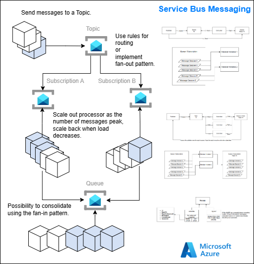

# Azure Service Bus - Messaging Features Demo 

This repository demonstrates key Azure Service Bus messaging capabilities including topics, subscriptions, message routing with filters, queues, and common processing patterns using .NET 9. 

## Infrastructure Overview

Provisioned resources (via ARM templates in `/infra`)
For details on provisioning and configuring the required Azure resources, see the [infra/README.md](/infra/README.md) file.

## A concise list of the Azure Service Bus features in this demo

- Messaging entity: A resource in Service Bus (queue, topic, or subscription) where messages are stored and exchanged.
- Topic: A publish/subscribe entity that allows one message to be sent and delivered to multiple subscribers.
- Subscription: A named, persistent view of a topic that receives a copy of published messages, optionally filtered.
- Queue: A first-in, first-out (FIFO) entity for point-to-point messaging between one producer and one consumer.
- Subscription Rule: A condition attached to a subscription that defines which messages it should receive.
- User property: A custom key/value pair on a message that can be used for filtering and routing.
- SQL Filter: An expression using SQL-like syntax to filter messages by system or user properties.
- Routing: The process of directing messages from topics to subscriptions based on filters and rules.
- Authorization Rule: A policy that defines access rights (send, listen, manage) to a messaging entity.

## Projects Overview

### Common project 

The Common project in this demo serves as a shared library that encapsulates reusable infrastructure and messaging logic for working with Azure Service Bus in .NET 9. 
It provides abstractions and utility classes such as ServiceBusClientFactory, which manages the lifecycle and caching of Service Bus clients, senders, and processors. 
Defines generic publisher and processor wrappers (ServiceBusPublisher<T> and ServiceBusProcessorWrapper<T>) that abstract away the low-level details of message serialization, sending, and processing. 
These wrappers enable application code to focus on business logic rather than messaging boilerplate. 

### FileSender project 
The FileSender project demonstrates an approach to publishing messages to Azure Service Bus topics. 
The project leverages the ServiceBusClientFactory from the shared Common library to manage the creation and reuse of Service Bus senders.
When sending messages, FileSender constructs strongly-typed FileMessage objects representing files to be processed, serializes them to JSON, and attaches a custom fileType property to each message. 
The fileType property enables downstream consumers to filter and route messages based on file type (e.g., "pdf" or "txt"). 
Send messages to `file-topic`.

### PdfFileProcessor project 

The PdfFileProcessor project illustrates consuming and processing messages from an Azure Service Bus subscription. 
The processor uses the ServiceBusProcessorWrapper<FileMessage> from the shared Common library to abstract away the complexity of message handling, error management, and resource cleanup.
When a PDF file message arrives (filtered by the subscription), the processor logs the file being processed and simulates chunking the file into smaller parts. 
For each chunk, it creates a ChunkMessage and sends it to a downstream queue for further processing. 
This design demonstrates decoupling message processing stages, handling errors, and maintaining scalability.
Consume messages of Subscription `PdfFileReceiver` processes messages (filter: `fileType = 'pdf'`) and sends messages to Queue `chunk-queue`.

### TxtFileProcessor project 

The TxtFileProcessor project exists to demonsrates routing in ServiceBus.
Consume messages of Subscription `TxtFileReceiver` processes messages (filter: `fileType = 'txt'`) and sends messages to Queue `chunk-queue`.

### ChunkEmbedder project 

The ChunkEmbedder project demonstrates for consuming messages from an Azure Service Bus queue and processing them in a stateless, event-driven manner. 
Using the ServiceBusProcessorWrapper<ChunkMessage> from the shared Common library.
When a chunk message arrives in the queue, the processor logs the chunk index and file ID, simulating the processing or embedding of each chunk. 
The application uses a short idle timeout to determine when to gracefully shut down if no new messages are received, which is useful for batch or demo scenarios. 
This approach highlights point-to-point message processing in distributed systems.

## Architecture Flow 

1. **Publisher** sends messages to `file-topic` with a property `fileType` (e.g., `txt` or `pdf`).  
2. **Subscriptions** apply filters and receive only relevant messages.  
3. **Receivers** process subscription messages.  
4. **Queue processing**: Processed chunks are sent to `chunk-queue` for downstream handling.  

## Prerequisites

- [.NET 9 SDK](https://dotnet.microsoft.com/download/dotnet/9.0)  
- [Azure CLI](https://docs.microsoft.com/cli/azure/install-azure-cli)  
- Azure subscription  
- PowerShell or Bash  

### Run the demo

Configure your app with the Service Bus connection string.

Run the respective projects in the following order:
1. FileSender
2. PdfFileProcessor
3. TxtFileProcessor
4. ChunkEmbedder

Verify that messages are routed correctly and processed through subscriptions and queues.

## Additional Resources

- [Azure Service Bus Documentation](https://learn.microsoft.com/azure/service-bus-messaging/)
- [Message Filters](https://learn.microsoft.com/azure/service-bus-messaging/topic-filters)
- [.NET Service Bus SDK](https://learn.microsoft.com/dotnet/api/overview/azure/messaging.servicebus-readme)