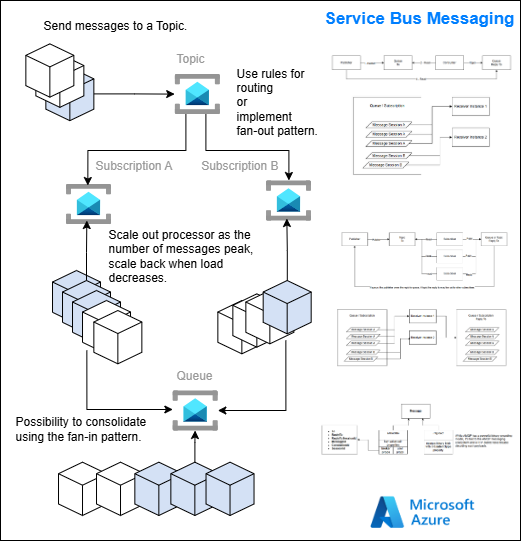

# Azure Service Bus Messaging Demo

This module demonstrates a small message-driven workflow on Azure Service Bus using .NET 9. It covers topics, subscriptions, SQL filters, queues, and chained processing stages while keeping the sample split into focused projects.

[](SB-SB6.drawio.png)

## What This Module Covers

- Topic-based publish/subscribe
- Subscription filtering with custom message properties
- Queue-based downstream processing
- Shared infrastructure helpers for senders and processors
- A separate infrastructure package in `infra`

## Structure

```text
Azr.SvcBus.Msging/
|-- README.md
|-- Azr.SvcBus.Msging.sln
|-- src/
|   |-- Common/
|   |-- FileSender/
|   |-- PdfFileProcessor/
|   |-- TxtFileProcessor/
|   `-- ChunkEmbedder/
`-- infra/
    |-- README.md
    |-- azuredeploy.json
    |-- azuredeploy.parameters.json
    `-- deploy_template.sh
```

## Project Guide

### Common

Shared abstractions for Service Bus operations, including reusable client, publisher, and processor helpers.

### FileSender

Publishes `FileMessage` payloads to `file-topic` and sets the `fileType` property so subscriptions can route the messages.

### PdfFileProcessor

Consumes from the PDF-focused subscription, simulates chunking, and forwards chunk messages to `chunk-queue`.

### TxtFileProcessor

Consumes from the TXT-focused subscription and demonstrates filtered routing behavior.

### ChunkEmbedder

Consumes chunk messages from the queue and simulates the next processing stage.

## End-to-End Flow

1. `FileSender` publishes messages to `file-topic`.
2. Subscriptions filter by `fileType`.
3. The processors handle only the messages intended for them.
4. Processed chunks are pushed to `chunk-queue`.
5. `ChunkEmbedder` consumes the queue messages.

## Running the Demo

1. Provision the Service Bus resources using [infra/README.md](infra/README.md).
2. Configure the connection string for the projects that need it.
3. Run the projects in this order:

```text
1. FileSender
2. PdfFileProcessor
3. TxtFileProcessor
4. ChunkEmbedder
```

## Additional Resources

- [Azure Service Bus documentation](https://learn.microsoft.com/azure/service-bus-messaging/)
- [Topic filters and actions](https://learn.microsoft.com/azure/service-bus-messaging/topic-filters)
- [.NET Service Bus SDK overview](https://learn.microsoft.com/dotnet/api/overview/azure/messaging.servicebus-readme)
